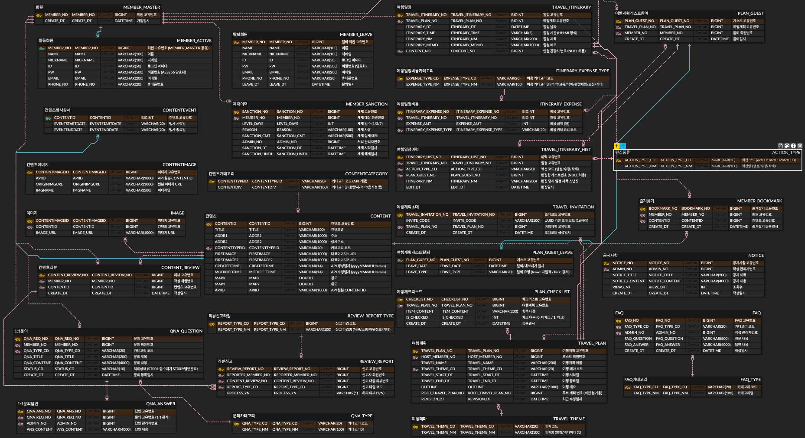
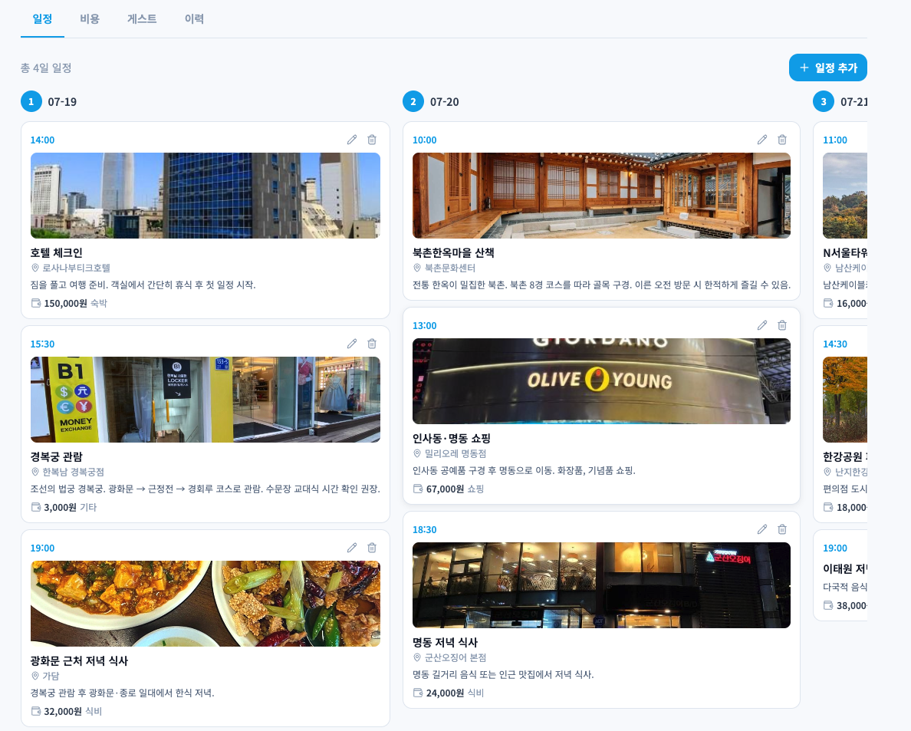
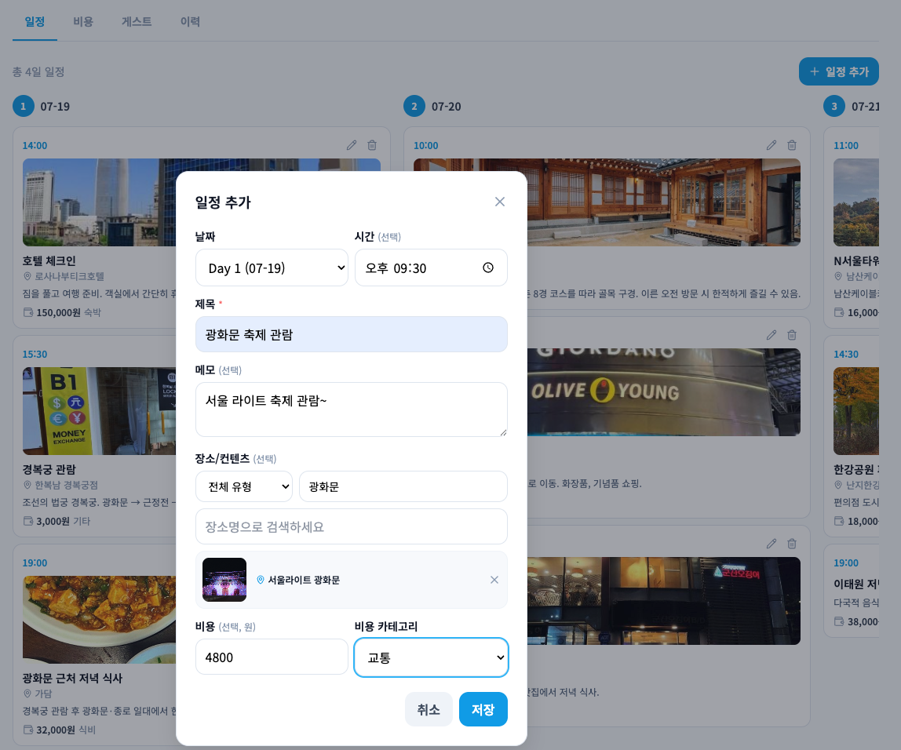
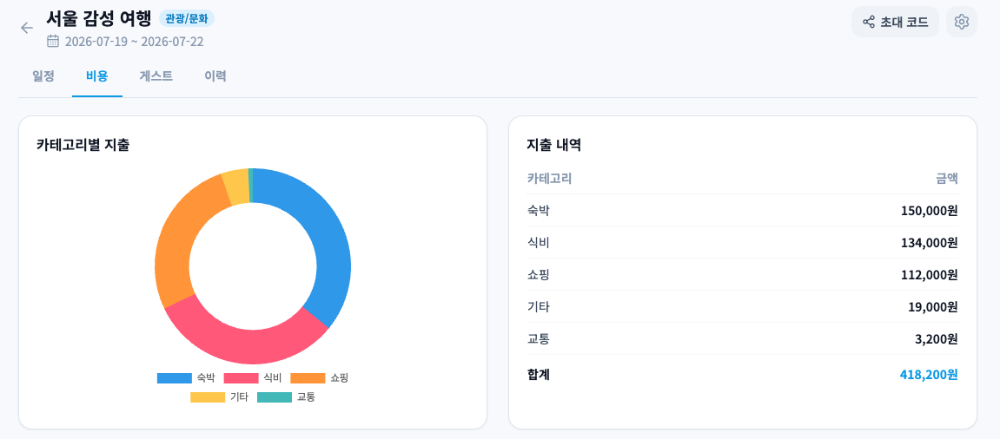
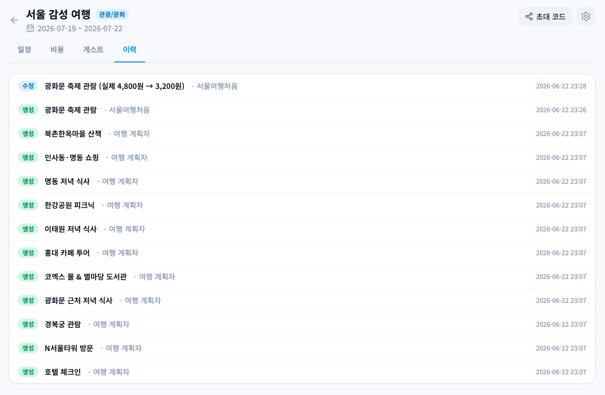
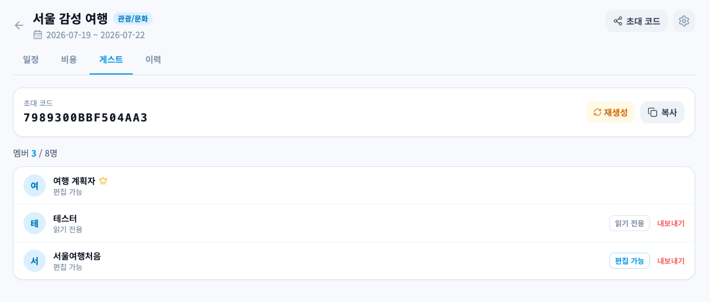

# TravleMate

> 5인 팀 프로젝트 | Spring Boot MVC 기반 협업 여행 플랫폼

---

## 목차

1. [프로젝트 소개](#프로젝트-소개)
2. [주요 기능](#주요-기능)
3. [기술 스택](#기술-스택)
4. [ERD](#erd)
5. [담당 파트](#담당-파트)

---

## 프로젝트 소개

TravleMate는 5인 팀이 함께 개발한 협업 여행 플랜 웹 서비스입니다.  
한국관광공사 Tour API와 연동하여 전국 관광지·축제 정보를 제공하고,  
게스트 초대·일정 공동 편집·비용 관리·체크리스트 등 여행 준비에 필요한 기능을 한 곳에서 제공합니다.

---

## 주요 기능

| 구분 | 기능 |
|------|------|
| **콘텐츠** | 관광지·축제 목록 조회, 키워드/지역/카테고리 검색, 상세 정보 및 리뷰 |
| **여행 플랜** | 플랜 생성·수정·삭제, 테마/날짜 필터, 초대코드로 게스트 참여 |
| **일정 관리** | 날짜별 일정 추가·수정·삭제, 컨텐츠 연동, 편집 이력 기록, 비용 관리 |
| **체크리스트** | 여행 준비물 항목 추가·완료 체크 |
| **리뷰** | 관광지 리뷰 작성·수정·삭제, 블라인드 처리, 신고 |
| **회원** | 회원가입·로그인·마이페이지·탈퇴 |
| **관리자** | 회원·콘텐츠·리뷰·신고·테마·FAQ·QnA·공지사항 관리 |

---

## 기술 스택

| 구분 | 사용 기술 |
|------|-----------|
| **Backend** | Java 21, Spring Boot 3.5, MyBatis 3 |
| **Database** | Oracle DB, DBMS_SCHEDULER (Tour API 주간 동기화) |
| **Frontend** | JSP, JSTL, HTML/CSS/JavaScript, Chart.js |
| **Build** | Gradle, Tomcat (Embedded) |
| **형상 관리** | GitHub |
| **외부 API** | 한국관광공사 Tour API (areaBasedList2, searchFestival2, detailImage2) |

---

## ERD

---

## 담당 파트

---

### ① 일정 관리

#### 개요

여행 계획 상세 페이지에서 날짜별 일정을 추가·수정·삭제합니다.  
일정 저장 시 비용 정보도 함께 처리하며, 추가·수정·삭제 시마다 편집 이력이 자동 기록됩니다.  
관광지·숙박·음식점 컨텐츠를 검색하여 일정에 연결하면 이미지와 장소 정보가 함께 표시됩니다.

#### URL 목록

| 메서드 | URL | 설명 |
|--------|-----|------|
| GET | `/plans/{planNo}/itinerary/{no}` | 일정 단건 조회 (수정 모달 초기값) |
| POST | `/plans/{planNo}/itinerary` | 일정 추가 |
| PUT | `/plans/{planNo}/itinerary/{no}` | 일정 수정 |
| DELETE | `/plans/{planNo}/itinerary/{no}` | 일정 삭제 |

#### 주요 구현 포인트

- 일정 저장·수정 시 비용 저장과 이력 기록이 단일 트랜잭션으로 처리됩니다.
- 관광지를 검색해 일정에 연결하면 이미지·장소 정보가 자동으로 함께 표시됩니다.
- 삭제된 일정은 별도 이력 테이블에 보존되며, 활성 일정 조회 시 자동으로 제외됩니다.

---

### ② 비용 관리

#### 개요

일정 추가·수정 시 카테고리별 비용(실지출·예상지출·결제수단)을 함께 저장합니다.  
계획 상세 페이지 진입 시 카테고리별 합계를 Chart.js 도넛 차트로 시각화합니다.

#### 주요 구현 포인트

- 비용 정보를 일정 요청에 통합해 별도 요청 없이 함께 처리합니다.
- 카테고리 매칭 실패 시 자동으로 '기타'로 분류됩니다.
- 비용 수정은 기존 내역 삭제 후 재삽입 방식으로 일관성을 유지합니다.
- 카테고리별 실지출·예상지출 합계를 집계해 도넛 차트 데이터로 전달합니다.

---

### ③ 변경 이력 자동 기록

#### 개요

일정 추가·수정·삭제 시 변경 이력이 자동 저장됩니다.  
계획 상세 페이지 이력 탭에서 전체 변경 내역을 작성자·일시 기준 타임라인으로 조회할 수 있습니다.

#### 주요 구현 포인트

- 수정 전·후를 비교해 변경된 항목(날짜·시간·제목·메모·컨텐츠·비용·카테고리)을 자동으로 요약해 저장합니다.
- 변경을 수행한 게스트 정보도 함께 기록되어 타임라인에서 작성자를 확인할 수 있습니다.
- 액션 타입(생성·수정·삭제)을 코드가 아닌 이름으로 관리해 DB 값 변경에 유연하게 대응합니다.

---

### ④ 편집 잠금

#### 개요

여행 기간 중이거나 종료 후 7일을 초과한 경우 일정 편집을 차단합니다.  
공통 가드에서 잠금 조건을 판단하며, 모든 일정 변경 요청에 동일하게 적용됩니다.

---

### ⑤ 3단계 권한 검증

#### 개요

일정 변경 요청마다 세 단계의 권한을 순서대로 검증합니다.  
각 단계 실패 시 다른 HTTP 상태 코드를 반환하여 클라이언트가 실패 원인을 명확히 파악할 수 있습니다.

---

### ⑥ 게스트 · 초대 관리

#### 개요

초대 코드 방식과 직접 초대 방식 두 가지로 게스트를 초대할 수 있습니다.  
호스트는 게스트별 편집 권한을 설정하거나 내보낼 수 있으며, 호스트 위임도 지원합니다.

#### URL 목록

| 메서드 | URL | 설명 |
|--------|-----|------|
| POST | `/plans/join` | 초대 코드로 계획 참여 |
| POST | `/plans/{planNo}/invite` | 초대 코드 재생성 (호스트) |
| POST | `/plans/{planNo}/invite/member` | 특정 회원에게 직접 초대 (호스트) |
| POST | `/invitations/{invitationNo}/accept` | 초대 수락 |
| POST | `/invitations/{invitationNo}/decline` | 초대 거절 |
| DELETE | `/plans/{planNo}/leave` | 계획 탈퇴 (게스트 본인) |
| DELETE | `/plans/{planNo}/guest/{memberId}` | 게스트 내보내기 (호스트) |
| PUT | `/plans/{planNo}/guest/{memberId}/permission` | 게스트 편집 권한 변경 (호스트) |
| PUT | `/plans/{planNo}/host` | 호스트 위임 |

#### 주요 구현 포인트

- **초대 코드**: 16자리 코드를 발급·재생성하며, 코드 검증 후 게스트로 자동 등록됩니다.
- **직접 초대**: 수신자가 마이페이지에서 수락/거절하며, 수락 시 게스트로 자동 등록됩니다.
- **편집 권한**: 게스트별로 편집·읽기 전용 권한을 구분해 설정할 수 있습니다.
- **참여 제한**: 최대 8명 초과, 날짜가 겹치는 다른 계획에 중복 참여, 호스트 20개 초과 생성을 각각 차단합니다.
- **게스트 탈퇴**: 탈퇴 이력을 별도 테이블에 보존하며, 활성 게스트 조회 시 자동으로 제외됩니다.

